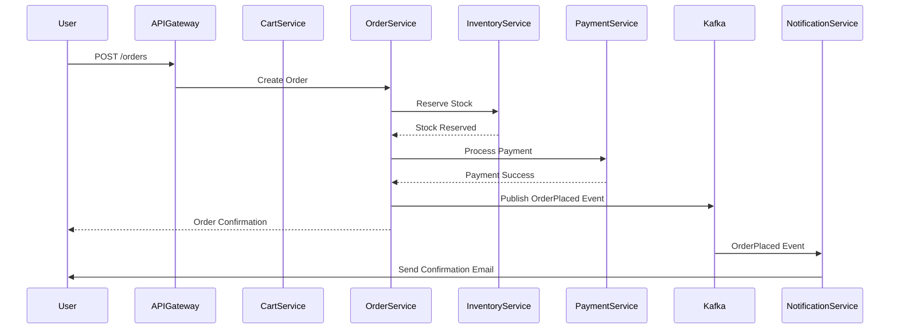

# Architecture Overview

This document provides a comprehensive view of the e-commerce platform's architecture, including high-level design, component interactions, and deployment topology.

## Table of Contents

1. [Architecture Principles](#architecture-principles)
2. [High-Level Architecture](#high-level-architecture)
3. [Microservices Design](#microservices-design)
4. [Data Architecture](#data-architecture)
5. [Infrastructure Architecture](#infrastructure-architecture)
6. [Security Architecture](#security-architecture)
7. [Deployment Architecture](#deployment-architecture)
8. [Architecture Diagrams](#architecture-diagrams)

---

## Architecture Principles

### Core Principles

1. **Microservices First**
   - Single responsibility per service
   - Independent deployment and scaling
   - Technology flexibility per service

2. **API-Driven**
   - Well-defined service contracts
   - RESTful APIs for external clients
   - gRPC for internal service communication

3. **Event-Driven**
   - Asynchronous communication via events
   - Loose coupling between services
   - Event sourcing for audit trails

4. **Cloud-Native**
   - Containerized applications
   - Kubernetes orchestration
   - Horizontal scaling by default

5. **Security by Design**
   - Defense in depth
   - Zero trust networking
   - Encryption everywhere

6. **Observability First**
   - Comprehensive logging, metrics, tracing
   - Proactive monitoring and alerting
   - Data-driven decision making

---

## High-Level Architecture

### System Context

```
┌─────────────┐
│   Users     │
│  (Buyers)   │
└──────┬──────┘
       │
       │ HTTPS
       ▼
┌─────────────────────────────────────────────┐
│              CDN / WAF                      │
│         (CloudFlare / CloudFront)           │
└──────────────────┬──────────────────────────┘
                   │
                   ▼
┌─────────────────────────────────────────────┐
│           API Gateway                       │
│     (Authentication, Rate Limiting)         │
└──────────────────┬──────────────────────────┘
                   │
       ┌───────────┼───────────┐
       │           │           │
       ▼           ▼           ▼
┌──────────┐ ┌──────────┐ ┌──────────┐
│ Product  │ │   User   │ │   Cart   │
│ Service  │ │ Service  │ │ Service  │
└────┬─────┘ └────┬─────┘ └────┬─────┘
     │            │            │
     │            │            │
     └────────────┼────────────┘
                  │
       ┌──────────┼──────────┐
       │          │          │
       ▼          ▼          ▼
┌──────────┐ ┌──────────┐ ┌──────────┐
│  Order   │ │Inventory │ │ Payment  │
│ Service  │ │ Service  │ │ Service  │
└────┬─────┘ └────┬─────┘ └────┬─────┘
     │            │            │
     └────────────┴────────────┘
                  │
                  ▼
         ┌────────────────┐
         │  Event Bus     │
         │    (Kafka)     │
         └────────────────┘
```

### Architecture Layers

1. **Client Layer**
   - Web application (Next.js)
   - Mobile applications (iOS, Android) - future
   - Admin dashboard

2. **Edge Layer**
   - CDN for static content
   - Web Application Firewall (WAF)
   - DDoS protection

3. **API Gateway Layer**
   - Request routing
   - Authentication/Authorization
   - Rate limiting
   - Request/response transformation

4. **Service Layer**
   - Domain microservices
   - Business logic
   - Data validation

5. **Data Layer**
   - Relational databases (PostgreSQL)
   - Document databases (MongoDB)
   - In-memory stores (Redis)
   - Search engines (Elasticsearch)

6. **Integration Layer**
   - Message brokers (Kafka)
   - Event streaming
   - Service-to-service communication

7. **Infrastructure Layer**
   - Container orchestration (Kubernetes)
   - Service mesh (Istio - optional)
   - Observability stack

---

## Microservices Design

### Service Catalog

#### 1. API Gateway
**Responsibility**: Single entry point for all client requests

**Key Features**:
- Request routing
- Authentication (JWT validation)
- Rate limiting
- Request logging
- Protocol translation (HTTP to gRPC)

**Technology**: Kong / Nginx / Custom Go service

---

#### 2. User Service
**Responsibility**: User identity and profile management

**APIs**:
- POST /users/register
- POST /users/login
- GET /users/{id}
- PUT /users/{id}
- GET /users/{id}/addresses
- POST /users/{id}/addresses

**Database**: PostgreSQL (users, profiles, addresses)

---

#### 3. Product Service
**Responsibility**: Product catalog management

**APIs**:
- GET /products
- GET /products/{id}
- POST /products (seller/admin only)
- PUT /products/{id}
- DELETE /products/{id}
- GET /categories

**Database**: MongoDB (product catalog, flexible schema)

---

#### 4. Search Service
**Responsibility**: Product discovery and search

**APIs**:
- GET /search?q={query}
- GET /search/suggestions?q={query}
- GET /search/filters

**Database**: Elasticsearch (search index)

**Data Sync**: Consumes ProductUpdated events from Kafka

---

#### 5. Cart Service
**Responsibility**: Shopping cart management

**APIs**:
- GET /cart
- POST /cart/items
- PUT /cart/items/{id}
- DELETE /cart/items/{id}
- DELETE /cart

**Database**: Redis (session-based cart storage)

---

#### 6. Order Service
**Responsibility**: Order lifecycle management

**APIs**:
- POST /orders
- GET /orders/{id}
- GET /orders
- PUT /orders/{id}/cancel
- GET /orders/{id}/status

**Database**: PostgreSQL (orders, order_items, order_status)

**Events Published**: OrderPlaced, OrderCancelled, OrderShipped

---

#### 7. Inventory Service
**Responsibility**: Stock management and reservation

**APIs**:
- GET /inventory/{productId}
- POST /inventory/reserve
- POST /inventory/release
- PUT /inventory/{productId}

**Database**: PostgreSQL (inventory levels)

**Locking**: Redis distributed locks

---

#### 8. Payment Service
**Responsibility**: Payment processing

**APIs**:
- POST /payments
- GET /payments/{id}
- POST /payments/{id}/refund

**Database**: PostgreSQL (payment transactions)

**Integration**: Stripe, PayPal SDKs

**Events Published**: PaymentSucceeded, PaymentFailed

---

#### 9. Notification Service
**Responsibility**: Multi-channel notifications

**APIs**:
- POST /notifications/send

**Channels**:
- Email (SMTP, SendGrid)
- SMS (Twilio)
- Push notifications (FCM, APNS)

**Events Consumed**: OrderPlaced, OrderShipped, PaymentSucceeded

---

#### 10. Recommendation Service
**Responsibility**: Personalized product recommendations

**APIs**:
- GET /recommendations/user/{userId}
- GET /recommendations/product/{productId}

**Database**: MongoDB (user preferences, product embeddings)

**ML Models**: Collaborative filtering, content-based filtering

---

#### 11. Review Service
**Responsibility**: Product reviews and ratings

**APIs**:
- GET /products/{productId}/reviews
- POST /products/{productId}/reviews
- PUT /reviews/{id}
- DELETE /reviews/{id}

**Database**: MongoDB (reviews, ratings)

---

### Service Communication Patterns

#### Synchronous Communication
- **Use Case**: Request-response with immediate result needed
- **Protocol**: REST (HTTP/JSON) or gRPC
- **Examples**: 
  - API Gateway → User Service (authentication)
  - Order Service → Inventory Service (stock check)

#### Asynchronous Communication
- **Use Case**: Fire-and-forget, eventual consistency
- **Protocol**: Kafka events
- **Examples**:
  - Order Service → Notification Service (order confirmation)
  - Product Service → Search Service (index update)

---

## Data Architecture

### Database per Service Pattern

Each microservice owns its data and database:

```
Product Service → MongoDB (products_db)
User Service → PostgreSQL (users_db)
Order Service → PostgreSQL (orders_db)
Inventory Service → PostgreSQL (inventory_db)
Payment Service → PostgreSQL (payments_db)
Cart Service → Redis (cart_cache)
Search Service → Elasticsearch (product_index)
```

**Benefits**:
- Service independence
- Technology flexibility
- Easier scaling

**Challenges**:
- Distributed transactions (solved with SAGA pattern)
- Data consistency (eventual consistency acceptable)
- Cross-service queries (use CQRS and read models)

---

### Data Consistency Strategies

#### Strong Consistency
**Services**: Order, Payment, Inventory, User

**Approach**:
- ACID transactions within service boundaries
- SAGA pattern for cross-service workflows
- Distributed locks (Redis) for critical sections

#### Eventual Consistency
**Services**: Product, Search, Recommendation, Review

**Approach**:
- Event-driven updates via Kafka
- Idempotent event handlers
- Retry mechanisms with exponential backoff

---

### Caching Strategy

#### Multi-Level Caching

1. **CDN Cache** (Edge)
   - Static assets (images, CSS, JS)
   - TTL: 1 day - 1 year

2. **Application Cache** (Redis)
   - Product catalog
   - User sessions
   - API responses
   - TTL: 5 minutes - 1 hour

3. **Database Cache**
   - Query result cache
   - Connection pooling

**Cache Invalidation**:
- Event-based invalidation (ProductUpdated → invalidate cache)
- TTL-based expiration
- Manual purge for critical updates

---

## Infrastructure Architecture

### Kubernetes Cluster Architecture

```
┌─────────────────────────────────────────────┐
│           Ingress Controller                │
│              (Nginx / Traefik)              │
└──────────────────┬──────────────────────────┘
                   │
    ┌──────────────┼──────────────┐
    │              │              │
    ▼              ▼              ▼
┌────────┐    ┌────────┐    ┌────────┐
│ Pod    │    │ Pod    │    │ Pod    │
│ API GW │    │Product │    │ User   │
│        │    │Service │    │Service │
└────────┘    └────────┘    └────────┘
    │              │              │
    └──────────────┼──────────────┘
                   │
                   ▼
         ┌─────────────────┐
         │   Services      │
         │  (ClusterIP)    │
         └─────────────────┘
                   │
                   ▼
         ┌─────────────────┐
         │  Persistent     │
         │  Volumes        │
         └─────────────────┘
```

### Namespace Organization

```
production/
├── api-gateway/
├── services/
│   ├── user-service
│   ├── product-service
│   ├── order-service
│   └── ...
├── data/
│   ├── postgresql
│   ├── mongodb
│   ├── redis
│   └── elasticsearch
├── messaging/
│   └── kafka
└── observability/
    ├── prometheus
    ├── grafana
    └── jaeger
```

---

## Security Architecture

### Authentication Flow

```
1. User → Login Request → API Gateway
2. API Gateway → User Service (validate credentials)
3. User Service → Generate JWT token
4. API Gateway → Return JWT to user
5. User → Subsequent requests with JWT in header
6. API Gateway → Validate JWT signature
7. API Gateway → Route to services (inject user context)
```

### Authorization Model

**Role-Based Access Control (RBAC)**:
- **Roles**: Admin, Seller, Buyer, Guest
- **Permissions**: Defined per API endpoint
- **Enforcement**: API Gateway + service-level checks

### Network Security

```
Internet
    │
    ▼
┌─────────────┐
│     WAF     │ ← DDoS protection, rate limiting
└─────┬───────┘
      │
      ▼
┌─────────────┐
│  Ingress    │ ← TLS termination
└─────┬───────┘
      │
      ▼
┌─────────────┐
│   Services  │ ← Network policies (Pod-to-Pod)
└─────┬───────┘
      │
      ▼
┌─────────────┐
│  Databases  │ ← Private subnets, encryption
└─────────────┘
```

---

## Deployment Architecture

### Multi-Region Setup

```
┌──────────────┐       ┌──────────────┐       ┌──────────────┐
│  Region 1    │       │  Region 2    │       │  Region 3    │
│  (US-East)   │       │  (EU-West)   │       │  (AP-South)  │
│              │       │              │       │              │
│ K8s Cluster  │◄─────►│ K8s Cluster  │◄─────►│ K8s Cluster  │
│              │       │              │       │              │
│ PostgreSQL   │       │ PostgreSQL   │       │ PostgreSQL   │
│ (Primary)    │──────►│ (Replica)    │──────►│ (Replica)    │
└──────────────┘       └──────────────┘       └──────────────┘
        │                      │                      │
        └──────────────────────┴──────────────────────┘
                               │
                               ▼
                    ┌──────────────────┐
                    │   Global CDN     │
                    └──────────────────┘
```

### Deployment Strategies

1. **Rolling Update** (Default)
   - Gradual pod replacement
   - Zero downtime
   - Rollback capability

2. **Blue-Green Deployment**
   - Two identical environments
   - Instant traffic switch
   - Easy rollback

3. **Canary Deployment**
   - Gradual traffic shift (5% → 25% → 50% → 100%)
   - Monitor metrics during rollout
   - Automated rollback on errors

---

## Architecture Diagrams

### Placeholder: System Architecture Diagram
**File**: `system-architecture.png`

**Description**: Complete system overview showing all services, databases, message queues, and external integrations.

**To be created**: Use Draw.io or Mermaid

---

### Placeholder: Deployment Topology
**File**: `deployment-topology.png`

**Description**: Multi-region Kubernetes deployment with load balancers, databases, and networking.

**To be created**: Use Draw.io or Mermaid

---

### Placeholder: Data Flow Diagram
**File**: `data-flow.png`

**Description**: Order placement flow showing interactions between services, databases, and message queues.

**To be created**: Use Mermaid sequence diagram

---

### Example: Mermaid Sequence Diagram (Order Placement)



---

## Architecture Decision Records (ADRs)

Architecture decisions should be documented as ADRs in `docs/architecture/adr/`.

**Template**:
```markdown
# ADR-001: Use Microservices Architecture

## Status
Accepted

## Context
Need to build a scalable e-commerce platform...

## Decision
Adopt microservices architecture...

## Consequences
- Positive: Independent scaling, technology flexibility
- Negative: Increased complexity, distributed transactions

## Alternatives Considered
- Monolithic architecture
- Modular monolith
```

---

## Next Steps

1. Create detailed architecture diagrams
2. Define API contracts (OpenAPI specs)
3. Document data models
4. Define event schemas
5. Create deployment manifests

---

**Version**: 1.0.0  
**Last Updated**: 2025-10-26
